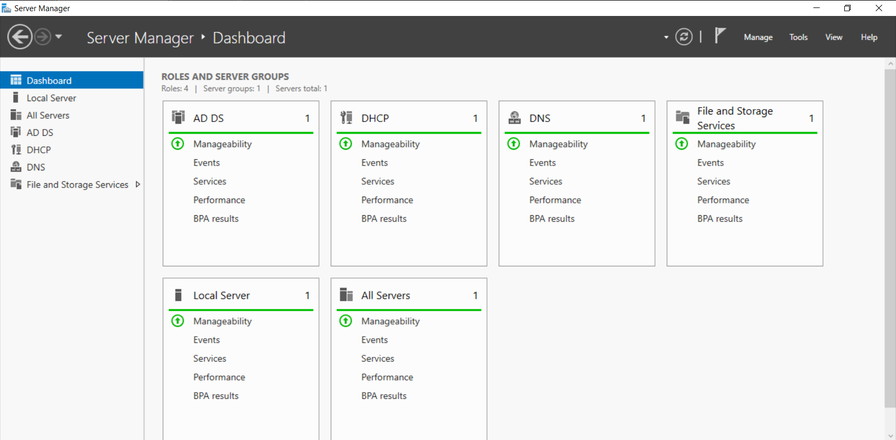
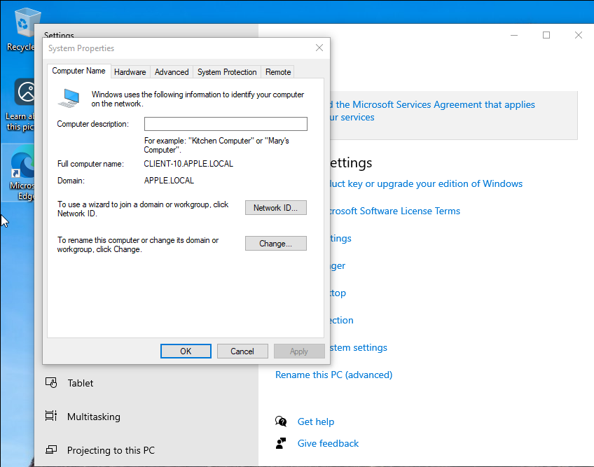
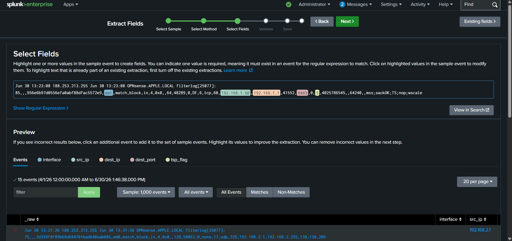
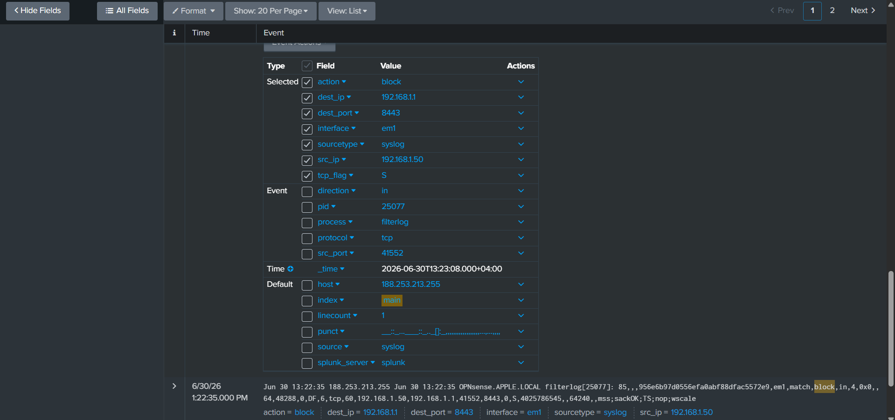
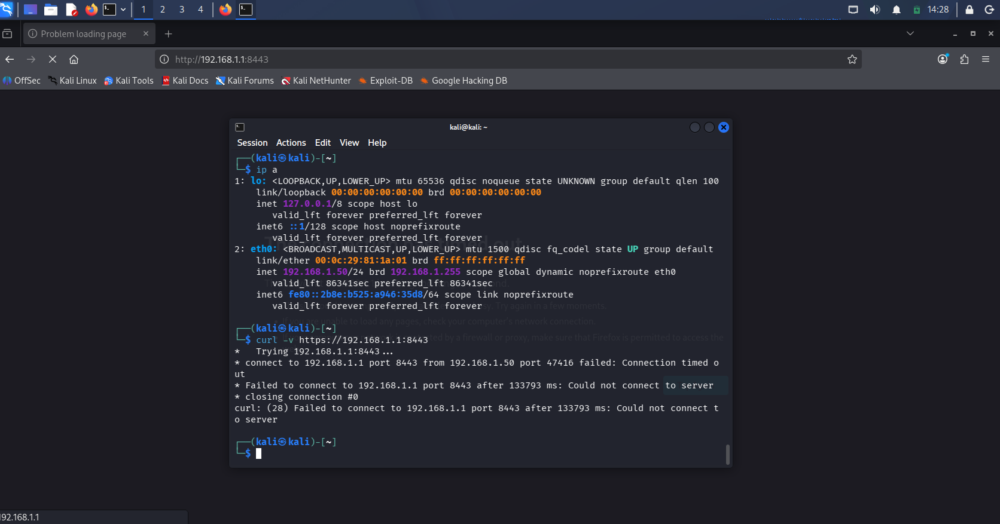
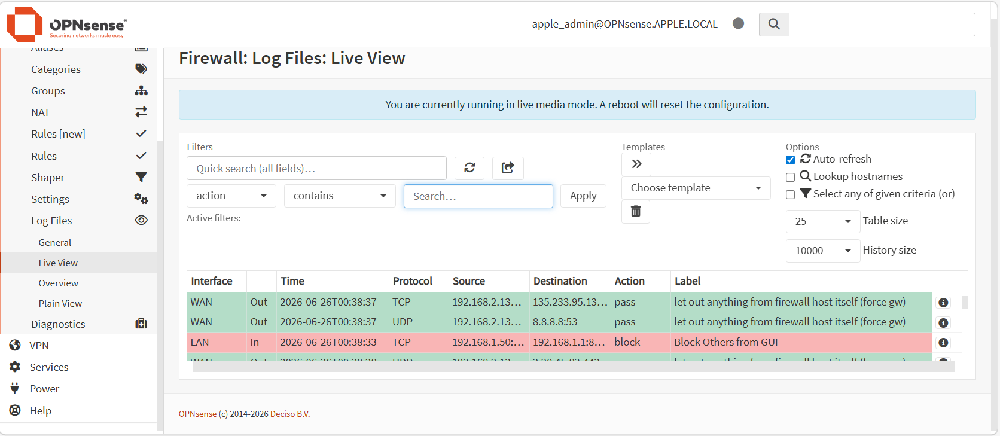
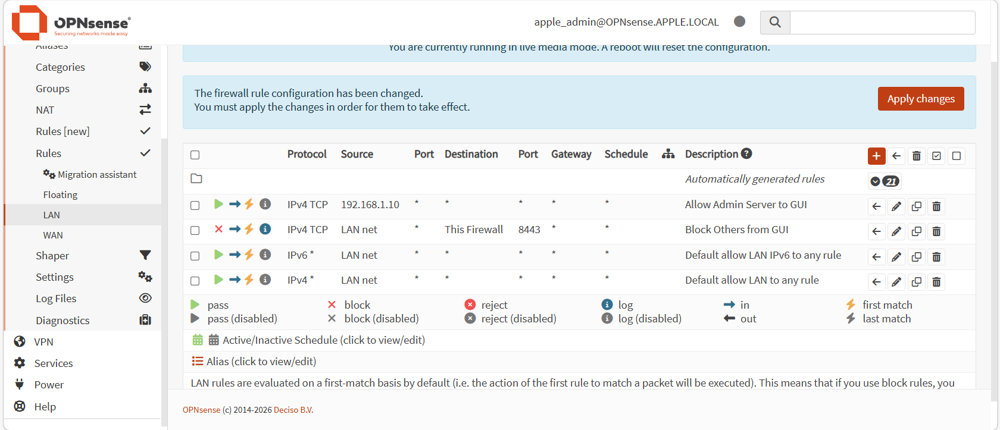
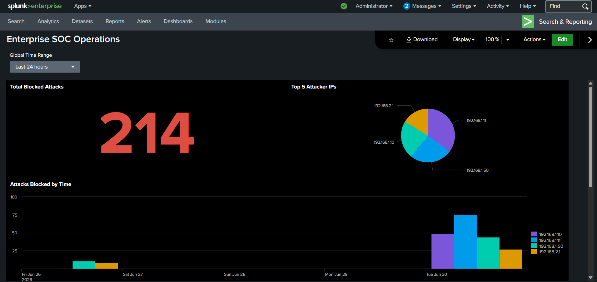

# 🛡️ Enterprise SOC & Network Security Architecture

## 📌 Project Overview
This repository contains the architecture, implementation, and analysis of an Enterprise-grade Security Operations Center (SOC) and Network Security laboratory built entirely from scratch. Running within an isolated, air-gapped local environment (VMware Workstation), this deployment demonstrates enterprise network segmentation using an OPNsense Firewall, central directory management via Windows Server Active Directory, and mərkəzi log ingestion and engineering using Splunk Enterprise SIEM.

## 🏗 Full Architecture & Workflow
The core of this architecture relies on strict security zones and central event collection to isolate corporate assets and maintain 100% visibility over network telemetry.

### 1. Infrastructure & Domain Backbone
The network is partitioned into distinct zones where OPNsense acts as the central security gateway. The core corporate domain is managed by a Windows Server Domain Controller, with enterprise clients joined directly to the secure tree.

**Step 1: Domain Controller Verification**
The domain infrastructure is anchored by Active Directory Domain Services (AD DS), DHCP, and DNS services running flawlessly on the Server core, managing the `APPLE.LOCAL` forest.

**Step 2: Endpoint Integration**
The corporate client workstation (`CLIENT-10`) is successfully integrated and joined to the secure `APPLE.LOCAL` domain tree, ensuring unified identity tracking.

### 2. Log Management & Ingestion Engineering
To achieve centralized visibility, raw security telemetry from the firewall gateway and Windows systems is systematically onboarded. 

**Step 1: Interactive Field Extraction**
Raw, unstructured Syslog data coming from the OPNsense filtering engine is parsed inside Splunk using custom regex rules and the Interactive Field Extractor (IFX) to define granular security indicators.

**Step 2: Structured Security Fields**
The log processing engine normalizes the data. Raw sətirlər successfully map out actionable fields including actions (`block`), network interfaces (`em1`), and specific TCP flags (`tcp_flag = S`).

### 3. Threat Simulation & Defensive Controls
To validate defensive boundaries, unauthorized network sweeps and connection requests are simulated using an external **Kali Linux** platform.

**Step 1: Traffic Interruption**
An unauthorized connection request (`curl -v`) is launched from the attacker node (`192.168.1.50`). The packet is immediately dropped by the perimeter controls, resulting in a strict connection timeout.

**Step 2: Live View Dropped Events**
The OPNsense firewall routing layer instantly captures the anomalous incoming packet on the LAN interface and enforces a hard dropping action (`block`).

**Step 3: Perimeter Security Policy**
The defensive posture is maintained through the strict configuration and enforcement of the dedicated `Block Others from GUI` rule on the OPNsense security platform.

### 4. Analytical Visibility & Incident Dashboards
All parsed event logs and telemetry endpoints are aggregated into a highly professional, enterprise-grade dark mode tracking console to monitor the overall threat landscape.

The centralized dashboard provides a rich visual matrix for the Blue Team:
* **Total Blocked Attacks:** A high-visibility single-value tracker displaying **214** real-time blocked anomalies.
* **Top 5 Attacker IP Addresses:** A comprehensive pie chart grouping malicious entities by their source coordinates.
* **Attacks Blocked by Time:** A chronological column chart mapping out attack velocity and unexpected activity spikes over the timeline.

## 🛠 Technologies Used
* **SIEM / Logging Engine:** Splunk Enterprise
* **Network Security / Gateway:** OPNsense Firewall
* **Identity & Access Management:** Windows Server Active Directory (AD DS, DNS, DHCP)
* **Endpoint Operating System:** Windows 10 Enterprise
* **Attacker Simulation Platform:** Kali Linux

## 🚀 System Implementation Guidelines
To replicate this secure engineering lab within your own sandbox architecture:

1. **Virtual Switches:** Set up a closed host-only virtual switch network segment inside VMware Workstation.
2. **Gateway Setup:** Deploy OPNsense with a LAN interface handling the internal subnet and a WAN interface facing your external lab environment.
3. **Identity Framework:** Deploy Windows Server, promote it to a Domain Controller for `APPLE.LOCAL`, and bind your Windows 10 endpoints to this infrastructure.
4. **Data Onboarding:** Install Splunk, expose a receiver port, and route your OPNsense Syslogs directly to the SIEM index.
5. **Data Extraction:** Use the custom field extractions detailed in the log processing phase to normalize your firewall headers (`src_ip`, `dest_port`, `tcp_flag`).
6. **Validation:** Execute probing commands from Kali Linux and verify the real-time telemetry updates across your OPNsense live logs and central Splunk panels.

## 👤 Author
**Anar Musayev**
* [GitHub Profile](https://github.com/Musa3w)
* [LinkedIn Profile](https://www.linkedin.com/in/anarmusayev-/)
